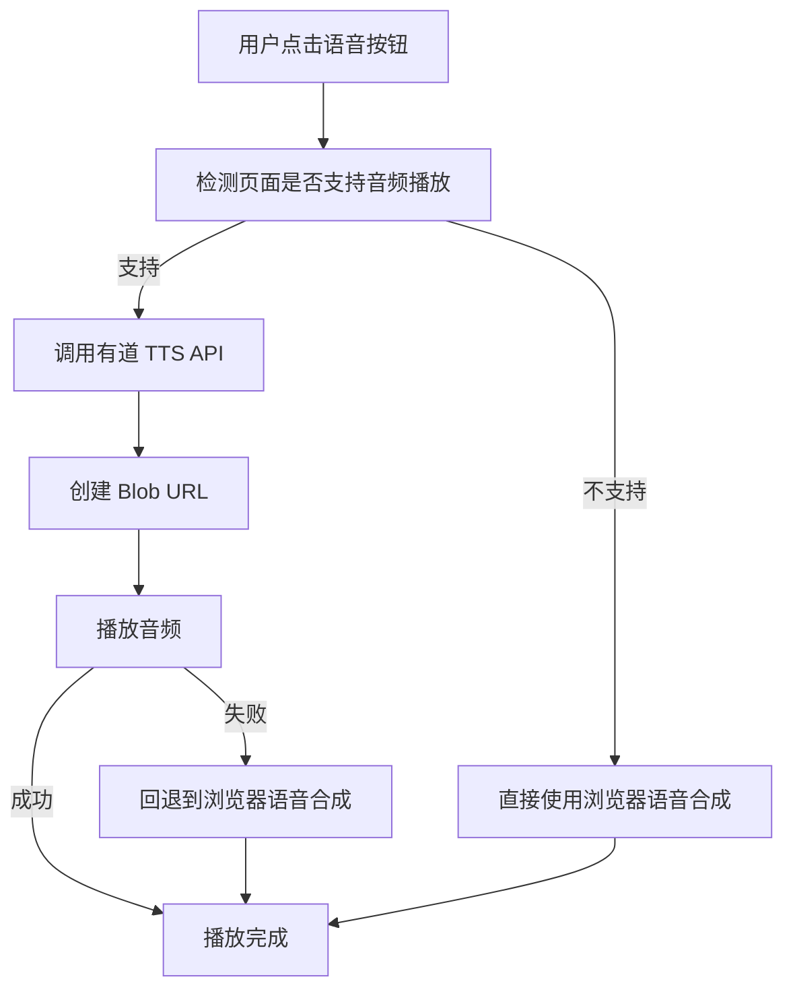

# 有道 TTS 音频播放解决方案

## 问题背景

在有严格 Content Security Policy (CSP) 的网站上（如 GitHub、GitLab 等），直接使用 `data:` URL 播放音频会被阻止，出现以下错误：

```
Refused to load media from 'data:audio/mp3;base64,...' because it violates the following Content Security Policy directive: "media-src ..."
```

## 解决方案

我们实现了多种音频播放方案，按优先级依次尝试：

### 1. Blob URL 方案（推荐）

**原理：** 将 base64 音频数据转换为 Blob 对象，然后创建 Blob URL

**优点：**
- 避免了 `data:` URL 的 CSP 限制
- 内存使用更高效
- 支持大文件播放

**实现：**
```typescript
private async createBlobUrl(audioData: { audioData: string; format: string }): Promise<string> {
  // 将 base64 转换为二进制数据
  const binaryString = atob(audioData.audioData);
  const bytes = new Uint8Array(binaryString.length);
  for (let i = 0; i < binaryString.length; i++) {
    bytes[i] = binaryString.charCodeAt(i);
  }
  
  // 创建 Blob
  const blob = new Blob([bytes], { type: `audio/${audioData.format}` });
  
  // 创建 Blob URL
  return URL.createObjectURL(blob);
}
```

### 2. Data URL 方案（备用）

**原理：** 直接使用 base64 编码的 data URL

**缺点：**
- 在严格 CSP 环境下被阻止
- 内存使用较大

**实现：**
```typescript
audio.src = `data:audio/${audioData.format};base64,${audioData.audioData}`;
```

### 3. 浏览器原生语音合成（回退方案）

**原理：** 使用浏览器的 `SpeechSynthesisUtterance` API

**优点：**
- 不受 CSP 限制
- 无需网络请求
- 支持多种语言和语音

**缺点：**
- 语音质量可能不如有道 TTS
- 依赖浏览器实现

**实现：**
```typescript
private fallbackToBrowserSpeech(button?: HTMLButtonElement | null): void {
  const text = this.currentTranslation?.original?.trim();
  if (!text) return;

  const lang = (this.currentTranslation?.detectedSourceLanguage || this.currentTranslation?.sourceLang || 'en').toLowerCase();
  const locale = this.mapLanguageToLocale(lang);
  this.speakWithSpeechSynthesis(locale, text, { button });
}
```

## 智能检测机制

### 域名检测
预先检测当前页面是否在已知的限制域名上：

```typescript
const restrictedDomains = [
  'github.com',
  'github.io', 
  'gitlab.com',
  'bitbucket.org'
];

if (restrictedDomains.some(domain => hostname.includes(domain))) {
  console.log('检测到限制域名，跳过音频播放');
  return false;
}
```

### 功能检测
检测浏览器是否支持必要的 API：

```typescript
private canPlayAudio(): boolean {
  // 检查 Audio 构造函数
  if (typeof Audio === 'undefined') return false;
  
  // 检查 Blob 和 URL.createObjectURL
  if (typeof Blob === 'undefined' || typeof URL.createObjectURL === 'undefined') return false;
  
  // 尝试创建测试音频
  const testAudio = new Audio();
  if (!testAudio) return false;
  
  return true;
}
```

## 播放流程



## 错误处理

### 1. 音频播放失败
```typescript
audio.onerror = (error) => {
  console.warn('有道 TTS 音频播放失败，可能是 CSP 限制，回退到浏览器语音:', error);
  finish();
  this.fallbackToBrowserSpeech(button);
};
```

### 2. 异常捕获
```typescript
try {
  await audio.play();
} catch (error) {
  console.error('播放有道 TTS 音频失败，可能是 CSP 限制，回退到浏览器语音:', error);
  this.fallbackToBrowserSpeech(button);
}
```

## 资源管理

### Blob URL 清理
```typescript
const finish = () => {
  if (button) {
    this.setButtonSpeaking(button, false);
  }
  // 清理 Blob URL，避免内存泄漏
  if (blobUrl.startsWith('blob:')) {
    URL.revokeObjectURL(blobUrl);
  }
};
```

## 其他可能的方案

### 1. Web Audio API
```typescript
// 使用 Web Audio API 解码和播放音频
const audioContext = new AudioContext();
const audioBuffer = await audioContext.decodeAudioData(audioData);
const source = audioContext.createBufferSource();
source.buffer = audioBuffer;
source.connect(audioContext.destination);
source.start();
```

### 2. 临时文件下载
```typescript
// 创建临时下载链接
const blob = new Blob([audioBytes], { type: 'audio/mp3' });
const url = URL.createObjectURL(blob);
const a = document.createElement('a');
a.href = url;
a.download = 'audio.mp3';
a.click();
```

### 3. 后台页面播放
```typescript
// 在后台页面播放音频，通过消息传递控制
chrome.runtime.sendMessage({
  action: 'playAudio',
  audioData: audioData
});
```

## 性能优化

1. **预检测：** 在播放前检测环境支持，避免不必要的 API 调用
2. **资源清理：** 及时释放 Blob URL，避免内存泄漏
3. **错误恢复：** 多层回退机制，确保用户体验
4. **缓存机制：** 可以考虑缓存音频数据，减少重复请求

## 测试建议

1. **GitHub 页面测试：** 验证在 GitHub 上的回退机制
2. **普通网站测试：** 验证 Blob URL 播放功能
3. **网络异常测试：** 验证网络错误时的处理
4. **浏览器兼容性测试：** 验证不同浏览器的支持情况

## 总结

通过实现多种音频播放方案和智能检测机制，我们解决了 CSP 限制下的音频播放问题，确保用户在任何环境下都能获得语音功能，提供了良好的用户体验和错误恢复能力。
